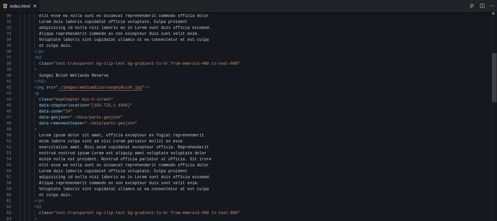
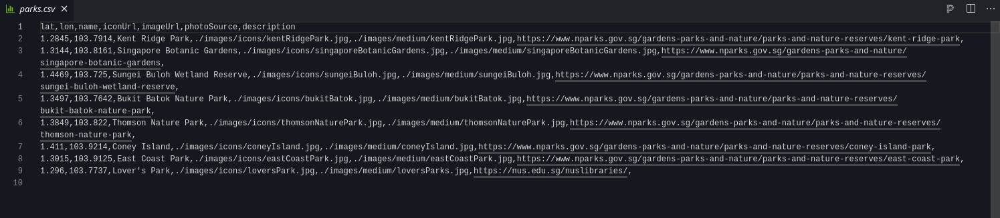

  

# A Short Introduction to Cartography on the Web

*All park's photos (except lover's park) are under copyright and belong to the [National Parks Board of Singapore](https://nparks.gov.sg), which graciously authorized their use for this template. Reuse of these images without authorization is prohibited outside of this template.*

## How to use the template

Open the template in one of these free online services to start editing right away!

### Editing the story

Edit `index.html` to add chapters to the story.

An html element with the `mapChapter` class will be able to trigger events on the map.

The different events are defined through the different `data` attributes on this element.

#### Moving the map to a given location

`data-chapterlocation` takes geographical coordinates in the shape `[lon,lat]` for instance `[103.816,1.3143]`. When an element with this attribute enters the screen, the map will pan to the given location.

#### Setting the zoom level of the map

`data-zoom` will set the zoom level of the map. `12` is a good value to show the whole of Singapore. A larger number means a greater magnification.

#### Adding markers on specific locations

`data-markers` will add markers on the map. The value should be a path to a csv file in the shape of the example `parks.csv`, for instance `./data/parks.csv`. Start the path from what is found in `public`, replacing `public` by a dot `.` to make sure your website works in most contexts.

Markers can be removed from the map when a chapter leaves the screen by adding `data-removeoverlays="1"`.

#### Adding a geojson layer

`data-geojson` will add shapes defined in a geojson file on the map. Similarly to the csv file, this should be placed in `public/data/` and the value should be a path like `./data/mygeojsonfile.geojson`.

#### Adding a WMS layer

To add a layer from [libmaps](https://libmaps.nus.edu.sg) use `data-addwmslayer` and enter the webservice url (such as https://libmaps.nus.edu.sg/gis/services/Sing_Hist_Maps/1860/MapServer/WMSServer). This url can be found on the libmaps website, under the hamburger menu for each map. But simply changing the year in the given url will work in most cases!

#### Removing layers

While the marker are overlays, both the geojson data and the wms layer are layers. To remove them when the element leaves the screen, use `data-removeonleave` and indicate as the value what was input in either `data-geojson` or `data-addwmslayer`.

### Managing the source data

Edit `parks.csv`, or create a new csv file with a similar shape, to input data for your markers. Don't forget to add the images in the `public/images/` folder!

Create a geojson file on [geojson.io](https://geojson.io) and upload it to `public/data/`

## Using the template locally

You can also adapt this project directly on your laptop! For this you will need to have installed git, node.js and npm.

Clone the repository:

`git clone git@github.com:Digital-Scholarship-NUS-Libraries/webCartographyTemplate.git`

Install all dependencies:

`npm i`

Run Vite in dev mode to quickly see the effect of your changes:

`npm run dev`

Build the site, the result will be found in the build folder and should be ready to be deployed on your hosting:

`npm run build`

## Other interesting tools

* [the original map storytelling template from mapbox](https://github.com/mapbox/storytelling)
* [kepler gl](https://kepler.gl/) is a powerful tool for large scale GIS data analysis, in 3D.
* [ArcGIS StoryMaps](https://storymaps.arcgis.com/) is a proprietary no code solution for telling stories with GIS data.
* [Kinghtlab's storymap](https://storymap.knightlab.com/) is a very popular no code solution for telling stories with maps.
